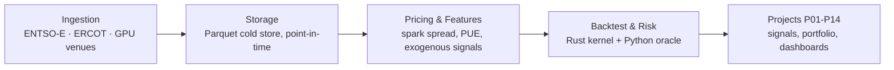
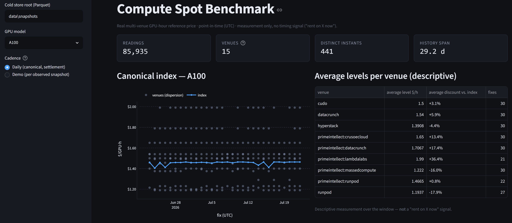
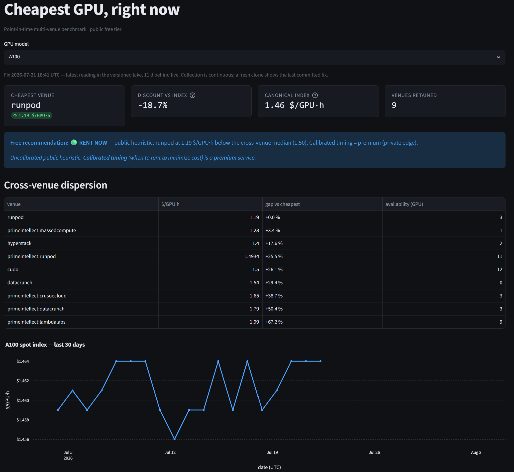

# Compute Quant Lab

[](https://github.com/clement-bbier/compute-quant-lab/actions/workflows/ci.yml)

A quant research lab that treats **compute** (GPU rental) as an asset class and arbitrages it against its raw material, **electricity**.

## The thesis

Renting a GPU and burning the electricity to power it are two legs of the same trade. The **digital spark spread** is the margin between them: compute revenue (€ or $ per GPU-hour, set by marketplaces like Vast.ai or RunPod) minus the energy cost of producing that GPU-hour (spot electricity price × power draw × PUE). When the spread is structurally wide, compute is cheap relative to its input cost; when it compresses or inverts, compute is expensive relative to the electricity that makes it possible. The lab's projects build the pricing, features, and backtest infrastructure to measure that spread point-in-time and test whether it is tradable.

## Architecture



## Quickstart

**Prerequisites**

| OS | Requirements |
|---|---|
| Windows | [uv](https://docs.astral.sh/uv/), [rustup](https://rustup.rs/) + Visual Studio Build Tools (MSVC C++ workload), `make` (Git Bash provides it) |
| Linux | [uv](https://docs.astral.sh/uv/), [rustup](https://rustup.rs/), `build-essential`, `make` |

Three Rust extension modules (pricing kernel, backtest loop, forward engine) are compiled locally via `maturin` — there's no prebuilt wheel, so a working Rust + C toolchain is required.

```bash
git clone https://github.com/clement-bbier/compute-quant-lab.git
cd compute-quant-lab
make sync    # uv sync --extra dev + builds the 3 Rust kernels
make test    # runs every test suite in isolation (22+ suites)
make demo    # launches the GPU spot benchmark dashboard (Streamlit)
```

If the kernels are missing or out of date (e.g. after a bare `uv sync`, which removes them), `make test` fails fast with a clear message and the fix:

```
kernels missing — run `make kernels`
```

Every Python code path also has a pure-Python fallback (`PythonOracle`), bit-for-bit tested against the Rust kernel — the lab never *requires* Rust to produce correct numbers, only to produce them fast.

## Data honesty

Every project defaults to **synthetic data**, and says so explicitly in its results. This is a methodological choice, not a placeholder: it lets the pipeline (point-in-time correctness, look-ahead guards, cost modeling, MLflow reproducibility) be validated and adversarially reviewed *before* any claim of edge is made on real markets. The line between "infrastructure validated" and "alpha claimed" is preregistered — see the signed [L0 ERCOT preregistration](docs/superpowers/specs/2026-06-23-L0-ercot-grid-stress-preregistration.md), frozen before the corresponding analysis ran, as the anti-p-hacking contract.

One branch runs on real data today: **ERCOT** (Texas grid, ~670 LOC across [`core/ingestion/energy/ercot.py`](core/ingestion/energy/ercot.py) and [`ercot_transport.py`](core/ingestion/energy/ercot_transport.py)), calibrated against the real-time market for grid-stress prediction ([P07](projects/07_exogenous_macro_signal/)).

The other data sources (ENTSO-E for FR/DE electricity, the GPU marketplaces) are coded and tested but run on synthetic fallbacks in this environment for lack of a live token — see [Live data](#live-data-optional) below to switch them on. The roadmap to fully real, continuously accumulated history is in [`docs/storage-roadmap.md`](docs/storage-roadmap.md).

## Live data (optional)

None of this is required for `make test` or CI — everything above runs on synthetic fixtures with zero network calls. Live data is opt-in, for anyone who wants to point the lab at real markets.

```bash
cp .env.example .env   # never commit .env
```

| Variable | Unlocks | Where to get it |
|---|---|---|
| `ENTSOE_API_TOKEN` | Real FR/DE electricity spot price (energy leg) | ENTSO-E Transparency Platform |
| `GRIDSTATUS_API_KEY` | ERCOT real-time market via a hosted API (bypasses the geoblock on ercot.com outside the US) | GridStatus.io |
| `VASTAI_API_KEY` | Vast.ai GPU marketplace connector | Vast.ai console |
| `RUNPOD_API_KEY` | RunPod GPU marketplace connector | RunPod console |
| `PRIMEINTELLECT_API_KEY` | Prime Intellect GPU marketplace connector | Prime Intellect console |
| `DATACRUNCH_CLIENT_ID` / `DATACRUNCH_CLIENT_SECRET` | DataCrunch GPU marketplace connector | DataCrunch console |
| `CUDO_API_KEY` | Cudo Compute GPU marketplace connector | Cudo Compute console |
| `HYPERSTACK_API_KEY` | Hyperstack GPU marketplace connector | Hyperstack console |
| `TENSORDOCK_API_KEY` / `TENSORDOCK_API_AUTHORIZATION` | TensorDock GPU marketplace connector | TensorDock console |
| `LAMBDA_API_KEY` | Lambda Cloud GPU marketplace (connector not yet built) | Lambda Cloud console |
| `CRUSOE_ACCESS_KEY_ID` / `CRUSOE_SECRET_KEY` | Crusoe Cloud GPU marketplace (connector not yet built) | Crusoe Cloud console |
| `GENESISCLOUD_API_KEY` | Genesis Cloud GPU marketplace (connector not yet built) | Genesis Cloud console |
| `SILICONDATA_API_TOKEN` | Canonical compute spot index (paid reference feed) | Silicon Data |

Live-dependent tests are marked `-m live` and are opt-in only (`uv run pytest -m live`); the default `make test` / CI never requires a key. The GitHub Actions collector ([`.github/workflows/collect.yml`](.github/workflows/collect.yml)) that accumulates GPU price history day over day reads these same variable names from repository secrets — no values live in this repo.

## Projects index

| Project | Question | Data |
|---|---|---|
| [P01 — Digital Spark Spread](projects/01_digital_spark_spread/) | What's the point-in-time margin between compute revenue and energy cost? | Synthetic |
| [P02 — Spread Mean Reversion](projects/02_spread_mean_reversion/) | Does the energy↔compute spread mean-revert tradably? | Synthetic |
| [P03 — GPU Vol & Term Structure](projects/03_gpu_vol_term_structure/) | Does the compute forward curve's shape (contango/backwardation) carry a signal? | Synthetic |
| [P04 — Compute Index & Curve](projects/04_compute_index_curve/) | What's a defensible spot index and simulated forward curve for compute? | Synthetic (real spot feeding in) |
| [P05 — Energy↔Compute Basis](projects/05_energy_compute_basis/) | How does the spread differ across regions (FR vs. DE), and why? | Synthetic |
| [P06 — Compute Futures Pricing](projects/06_compute_futures_pricing/) | What would compute futures (unlisted) be worth theoretically? | Synthetic |
| [P07 — Exogenous Macro Signal](projects/07_exogenous_macro_signal/) | Do gas price / weather lead the energy leg? | ERCOT branch real; rest synthetic |
| [P08 — Backtest & Risk Engine](projects/08_backtest_risk_engine/) | Can every strategy plug into one point-in-time, cost-aware backtest engine? | Synthetic |
| [P09 — ML Signal Ensemble](projects/09_ml_signal_ensemble/) | Does an XGBoost ensemble find directional edge without overfitting? | Synthetic |
| [P10 — Portfolio & Execution](projects/10_portfolio_execution/) | Does the desk survive once real signals meet real execution costs? | Synthetic |
| P11 — Storage Layer ([`core/storage/`](core/storage/)) | What's the versioned, point-in-time cold store every project reads from? | N/A (infra) |
| P12 — Signal Promotion ([`core/signals/`](core/signals/)) | How do P02/P06/P09 signals get promoted into one production interface? | N/A (infra) |
| [P13 — Compute Benchmark](projects/13_compute_benchmark/) | What's a publishable, auditable reference price for a GPU-hour? | Real |
| [P14 — Service Product](projects/14_service/) | Can the benchmark become a product (free measurement / paid timing)? | Real |

## Results

All figures below are reproducible by rerunning the cited command; where the artifact itself is committed, the table links straight to it (coverage output is regenerated fresh each run — see the `.gitignore` — and instead uploaded as a CI artifact on every push).

| Metric | Value | Source |
|---|---|---|
| Test suites | 22+ (fails below 20) | `make test` output / [Makefile](Makefile) |
| Combined coverage | 95% (8,331 statements) | `make coverage` (also uploaded as the `coverage-xml` artifact on [CI](https://github.com/clement-bbier/compute-quant-lab/actions/workflows/ci.yml)) |
| P01 mean spread | 2.024 EUR/GPU·h | [`projects/01_digital_spark_spread/results/run_summary.json`](projects/01_digital_spark_spread/results/run_summary.json) |
| P02 backtest Sharpe (simulated, flagged non-credible) | 7.70 | [`projects/02_spread_mean_reversion/results/SYNTHESIS.md`](projects/02_spread_mean_reversion/results/SYNTHESIS.md) |
| P08 engine demo Sharpe | 0.615 | [`projects/08_backtest_risk_engine/results/SYNTHESIS.md`](projects/08_backtest_risk_engine/results/SYNTHESIS.md) |
| P09 ensemble Sharpe / PSR | 0.17 / 0.66 | [`projects/09_ml_signal_ensemble/results/SYNTHESIS.md`](projects/09_ml_signal_ensemble/results/SYNTHESIS.md) |
| P10 desk net Sharpe (real signals, after costs) | −7.12 | [`projects/10_portfolio_execution/results/SYNTHESIS.md`](projects/10_portfolio_execution/results/SYNTHESIS.md) |
| P11 storage layer tests | 40 passed | [`core/storage/results/SYNTHESIS.md`](core/storage/results/SYNTHESIS.md) |
| P13 published models | 24 (A100, A40, A6000, B200, B300, CPUNODE, H100, H200, L4, L40, L40S, RTX3080, RTX3090, RTX4000ADA, RTX4090, RTX5080, RTX5090, RTX6000ADA, RTX6000ADA48GB, RTXPRO4000, RTXPRO4500, RTXPRO5000, RTXPRO6000B96GB, V100) across 15 venues | [`projects/13_compute_benchmark/results/benchmark_summary.md`](projects/13_compute_benchmark/results/benchmark_summary.md) |

The negative and near-zero Sharpes above are reported deliberately: [`/backtest-pitfalls`](.claude/skills/backtest-pitfalls/) auditing exists precisely to stop a flattering-but-fragile number from being presented as edge (see P02's own adversarial verdict on its 7.70).

## Screenshots

Not yet captured — placeholders below mark where they belong. To fill one in: run the launch command, get the dashboard into the described state, screenshot it, and save it under `docs/assets/` with the exact filename.

| Placeholder | Launch command | View to capture | File |
|---|---|---|---|
|  | `uv run streamlit run projects/13_compute_benchmark/dashboard/app.py` | Index curve + cross-venue dispersion cloud, at least one model with 2+ venues | `docs/assets/p13-benchmark-dashboard.png` |
|  | `uv run streamlit run projects/14_service/dashboard/app.py` | "Cheapest GPU right now" view with the free-tier heuristic recommendation visible | `docs/assets/p14-service-dashboard.png` |

## Roadmap

- Storage: cold-store phases 0-1 are done ([P11](core/storage/)); real-time serving (hot store, streaming) is phases 2-4, documented but not built — see [`docs/storage-roadmap.md`](docs/storage-roadmap.md).
- Energy leg: switch FR/DE from synthetic to real ENTSO-E once `ENTSOE_API_TOKEN` is configured — the connector is coded and tested, the switch is a config change, not a rewrite.

## License

[MIT](LICENSE)
